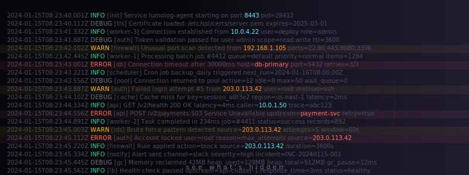

<p align="center">
  
</p>

<p align="center">
  <strong>A terminal log viewer that understands your logs.</strong><br/>
  Auto-detects formats. Parses structure. Surfaces what matters.
</p>

<p align="center">
  <a href="#quickstart">Quickstart</a> &middot;
  <a href="#features">Features</a> &middot;
  <a href="#supported-formats">Formats</a> &middot;
  <a href="#keybindings">Keybindings</a>
</p>

---

Lumolog is a TUI log viewer built for developers, SREs, and security teams. Point it at any log file and it automatically detects the format, parses structured fields, colorizes by severity, and gives you interactive tools to search, filter, and investigate — right from your terminal.

Most log viewers just make text pretty. Lumolog *understands* your logs — it knows what's an IP address, what's a timestamp, what's an error level, and lets you act on all of it.

<!-- TODO: Add hero demo video showing lumolog opening a JSON log file -->
<!-- <video src="assets/demo-hero.mp4" width="100%" autoplay loop muted></video> -->

## Quickstart

### Install

```bash
# From source (requires Rust 1.85+)
cargo install --path .
```

### Usage

```bash
# View a log file
lumolog app.log

# Pipe from any command
docker compose logs 2>&1 | lumolog
kubectl logs deploy/api | lumolog
cat /var/log/syslog | lumolog

# Follow mode (like tail -f)
lumolog -f /var/log/app.log
docker logs -f mycontainer 2>&1 | lumolog -f
```

Lumolog auto-detects the log format. No configuration needed.

## Features

### Auto-Format Detection & Highlighting

Lumolog samples the first lines of input and automatically identifies the log format. Structured fields are parsed and colorized — levels get color-coded badges, timestamps are dimmed, and inline patterns (IPs, URLs, UUIDs, file paths, HTTP methods, key=value pairs) are highlighted throughout.

Eight formats are detected automatically — see [Supported Formats](#supported-formats).

<!-- TODO: Add video showing format auto-detection across different log types -->
<!-- <video src="assets/demo-format-detection.mp4" width="100%" autoplay loop muted></video> -->

### Search & Filter

Press `/` to open the filter bar. Type a substring and matching lines are shown instantly with highlighted matches. If no exact matches are found, lumolog falls back to fuzzy matching automatically — type "conref" to find "connection refused".

The filter bar shows a live match count as you type: `/ error  (142 matches)` or `/ conref  (~38 fuzzy)`.

<!-- TODO: Add video showing search with substring match and fuzzy fallback -->
<!-- <video src="assets/demo-search-filter.mp4" width="100%" autoplay loop muted></video> -->

### Level Filtering & Stats Bar

A colored stats bar shows log level counts at a glance — `ERR:42 WRN:130 INF:1204`. Click any badge to filter to that level and above. Click again to clear.

You can also cycle through levels with `v` (stricter) and `V` (looser) from the keyboard. Level filtering composes with text search and time range — stack them to narrow down exactly what you need.

<!-- TODO: Add video showing level filtering via stats bar clicks and v/V cycling -->
<!-- <video src="assets/demo-level-filter.mp4" width="100%" autoplay loop muted></video> -->

### Time Range Selection

A sparkline density bar at the top shows log volume over time. Press `t` to enter time range mode and select a window with keyboard controls, or click and drag directly on the sparkline.

Quick presets: `1` for last 5 minutes, `2` for 15 minutes, `3` for 1 hour, `4` for 24 hours.

Time filtering composes with all other filters — combine a time window with a level filter and text search to isolate exactly the incident you're investigating.

<!-- TODO: Add video showing sparkline time range selection with mouse drag and keyboard -->
<!-- <video src="assets/demo-time-range.mp4" width="100%" autoplay loop muted></video> -->

### Click-to-Action

Click any highlighted token to open a context menu with relevant actions:

- **IP addresses** — filter by value or look up on AbuseIPDB
- **URLs** — filter by value or open in browser
- **UUIDs, paths, HTTP methods, key=value pairs** — filter by value

<!-- TODO: Add video showing click-to-action on an IP address and URL -->
<!-- <video src="assets/demo-click-action.mp4" width="100%" autoplay loop muted></video> -->

### JSON Pretty-Print

Press `p` to expand JSON log lines into indented, readable JSON. Scroll through expanded entries naturally — the viewport accounts for multi-line expansion. Press `p` again to return to compact view.

<!-- TODO: Add video showing JSON pretty-print toggle -->
<!-- <video src="assets/demo-json-pretty.mp4" width="100%" autoplay loop muted></video> -->

### Follow Mode

Use `-f` to tail a log file or stream stdin in real time. New lines appear at the bottom as they arrive. Press `Space` to pause and investigate, then `Space` again to resume. Works with files and piped stdin.

```bash
lumolog -f /var/log/app.log
docker logs -f mycontainer 2>&1 | lumolog -f
```

### Cursor Mode & Copy

Press `Enter` to activate cursor mode. A highlighted bar tracks your position as you move through lines with `j`/`k`. From cursor mode:

- `y` — yank the current line to clipboard
- `Y` — yank all filtered lines to clipboard
- `s` — filter to structurally similar lines (same template, different values)

Similar-line filtering is powerful for noisy logs — it computes a structural template by replacing IPs, numbers, UUIDs, URLs, and timestamps with wildcards, then shows all lines matching that shape.

### Command Palette

Press `?` to open a fuzzy-searchable command palette showing every available action with its keybinding. Type to filter, arrow keys to select, `Enter` to execute.

## Supported Formats

Lumolog auto-detects these formats by sampling the first lines of input:

| Format | Example |
|--------|---------|
| **JSON** | `{"level":"error","message":"failed","timestamp":"2024-01-15T10:30:00Z"}` |
| **Syslog** | `Jan 15 10:30:00 host sshd[1234]: Failed password for root` |
| **Logfmt** | `level=error msg="connection refused" host=api-1 duration=3.2s` |
| **klog** (Kubernetes) | `E0115 10:30:00.000000 1234 handler.go:42] error message` |
| **Log4j** | `2024-01-15 10:30:00 [main] ERROR com.app.Service - failed` |
| **Python logging** | `2024-01-15 10:30:00,123 - mymodule - ERROR - connection lost` |
| **Apache/Nginx** | `192.168.1.1 - - [15/Jan/2024:10:30:00 +0000] "GET /api" 500 1234` |
| **Plain text** | Any text — level keywords and timestamps are still detected |

Structured formats (JSON, logfmt, klog, Log4j, Python, Apache) extract level, timestamp, message, and extra fields into a compact `[LVL] timestamp message  key=value` view. Extra fields are rendered dimmed after the message.

## Pattern Highlighting

Lumolog recognizes and colorizes these inline patterns in all formats:

| Pattern | Color | Example |
|---------|-------|---------|
| URLs | Blue, underlined | `https://api.example.com/v1/users` |
| UUIDs | Magenta | `550e8400-e29b-41d4-a716-446655440000` |
| IPv4/IPv6 | Cyan, bold | `192.168.1.1`, `::1` |
| File paths | Green | `/var/log/app.log`, `./config/settings.toml` |
| Pointer addresses | Orange | `0x7fff5fbff8c0` |
| Unix processes | Blue, bold | `sshd[1234]` |
| HTTP methods | Magenta, bold | `GET`, `POST`, `DELETE` |
| Key=value | Blue bold key | `status=200`, `duration=3.2ms` |
| Quoted strings | Gold | `"connection refused"` |
| Keywords | Red, italic | `true`, `false`, `null`, `nil`, `NaN` |
| Numbers | Cyan | `42`, `3.14`, `500ms`, `2.4GB` |
| Dates | Gray | `2024-01-15T10:30:00Z` |
| Version numbers | Cyan | `v2.4.1`, `10.15.7` |

Patterns are matched in priority order — a URL won't have its path highlighted separately, and an IP inside a URL won't be double-colored.

## Keybindings

### Normal Mode

| Key | Action |
|-----|--------|
| `j` / `Down` | Scroll down |
| `k` / `Up` | Scroll up |
| `h` / `Left` | Scroll left |
| `l` / `Right` | Scroll right |
| `Space` / `PgDn` | Page down |
| `PgUp` | Page up |
| `g` | Go to top |
| `G` | Go to bottom |
| `/` | Open filter bar |
| `v` | Level filter up (stricter) |
| `V` | Level filter down (looser) |
| `p` | Toggle JSON pretty-print |
| `w` | Toggle line wrap |
| `t` | Enter time range mode |
| `Enter` | Enter cursor mode |
| `?` | Open command palette |
| `Esc` | Clear active filter (similar > time > text) |
| `q` | Quit |

### Filter Mode

| Key | Action |
|-----|--------|
| *Type* | Filter text (live results) |
| `Backspace` | Delete character |
| `Enter` | Accept filter and return to normal mode |
| `Esc` | Clear filter |

### Cursor Mode

| Key | Action |
|-----|--------|
| `j` / `Down` | Move cursor down |
| `k` / `Up` | Move cursor up |
| `y` | Yank current line to clipboard |
| `Y` | Yank all filtered lines to clipboard |
| `s` | Filter by similar lines |
| `Esc` | Exit cursor mode |

### Time Range Mode

| Key | Action |
|-----|--------|
| `h` / `Left` | Move cursor left |
| `l` / `Right` | Move cursor right |
| `H` / `L` | Move cursor left/right (fast) |
| `[` | Mark range start |
| `]` / `Enter` | Mark range end and apply |
| `1` | Last 5 minutes |
| `2` | Last 15 minutes |
| `3` | Last 1 hour |
| `4` | Last 24 hours |
| `c` | Clear time range |
| `Esc` | Exit time mode |

### Mouse

| Action | Effect |
|--------|--------|
| Click token | Open context menu (filter, lookup, open) |
| Click stats bar badge | Set level filter |
| Click + drag sparkline | Select time range |
| Scroll wheel | Scroll vertically |
| Horizontal scroll | Scroll horizontally (supported terminals) |

## Requirements

- Rust 1.85+ (edition 2024)
- A modern terminal emulator (Ghostty, Kitty, WezTerm, iTerm2, Alacritty)
- Mouse support requires a terminal with SGR mouse encoding

## License

MIT

---

> Lumolog is under active development. Features and interfaces may change.
